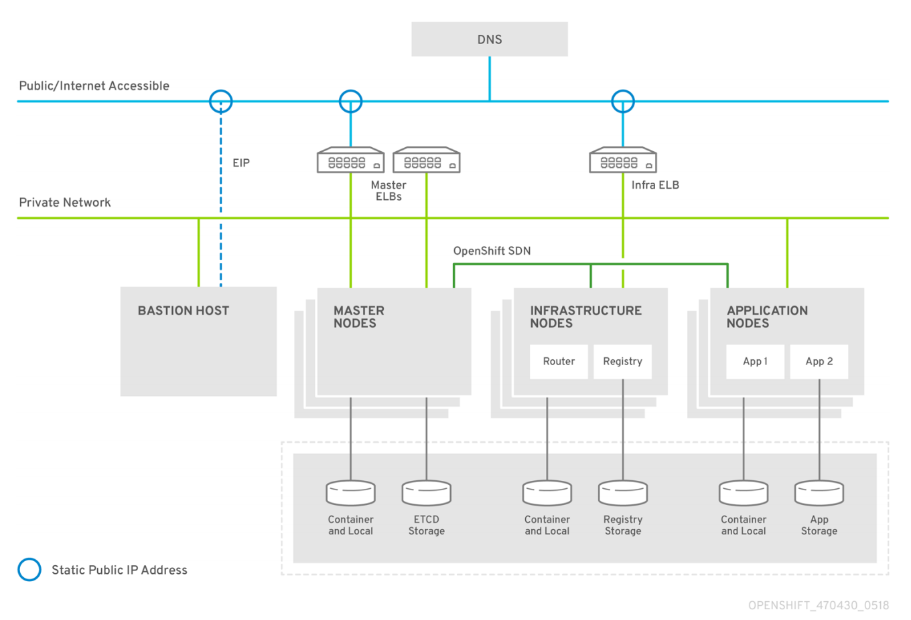

# AWS Installer

This installer sets up OpenShift on AWS in a HA configuration. This is a summary of the [official documentation](https://access.redhat.com/documentation/en-us/reference_architectures/2018/html/deploying_and_managing_openshift_3.9_on_amazon_web_services) with some "gottchas" outlined.

In the end you'll have the following.



You will need the following to get started
* An AWS IAM account
  * This account pretty much needs full access
  * AWS Secret Key
  * AWS Key ID
* Delegate a Subdomain to AWS Route53
* OpenShift Subs
* A host to launch the commands from (This is **NOT** the bastian host...this is like, your laptop or a vm on your laptop)

## Set Up Host

First, setup EPEL

```
yum install -y https://dl.fedoraproject.org/pub/epel/epel-release-latest-7.noarch.rpm
```

Now, install some key components

```
yum install -y python-pip jq unzip git
```

You won't need EPEL anymore so you can erase it if you'd like

```
yum -y erase epel-release
```

Next, you'll need to install the `awscli` tools. The below are "quicknotes" for more detailed information look [here](https://docs.aws.amazon.com/cli/latest/userguide/installing.html).

```
curl "https://s3.amazonaws.com/aws-cli/awscli-bundle.zip" -o "awscli-bundle.zip"
unzip awscli-bundle.zip
cd awscli-bundle
sudo ./install -i /usr/local/aws -b /usr/local/bin/aws
```

Verify with

```
aws --version
```

Now, you need to setup the Boto3 AWS SDK for Python. Again, these are "quicknotes". Detailed Boto3 AWS python bindings installation procedure is [here](http://boto3.readthedocs.io/en/latest/guide/quickstart.html#installation) and legacy Boto AWS python bindings installation procedure is [here](http://boto.cloudhackers.com/en/latest/getting_started.html)

Set up `boto` config in your homedir

```
cat << EOF > ~/.boto
[Boto]
debug = 0
num_retries = 10
EOF
```

Now install required versions (please look at the [official documentation](https://access.redhat.com/documentation/en-us/reference_architectures/2018/html/deploying_and_managing_openshift_3.9_on_amazon_web_services) for current versions)

```
pip install --upgrade pip
pip install boto3==1.5.24
pip install boto==2.48.0
```

Verify with

```
pip freeze | grep boto
```

Once you have that in place, export your `AWS_ACCESS_KEY_ID` and `AWS_SECRET_ACCESS_KEY` entries.

```
export AWS_SECRET_ACCESS_KEY=ZZZZZZZZZZZZZZZZZZZZZZZZZZZZZZZZZZZZZZZZ
export AWS_ACCESS_KEY_ID=XXXXXXXXXXXXXXXXXXXX
```

Now, test connectivity. Comamnds and sample (successful) output below

```
$ aws sts get-caller-identity

output:
{
    "Account": "123123123123",
    "UserId": "TH75ISMYR3F4RCHUS3R1D",
    "Arn": "arn:aws:iam::123123123123:user/refarchuser"
}


$ cat << EOF | python
import boto3
print(boto3.client('sts').get_caller_identity()['Arn'])
EOF

arn:aws:iam::123123123123:user/refarch
```

Set up your SSH keys. the `clusterid` can be anything, and `dns_domain` needs to be the domain you delegated. The `region` is where you want to install OCP.

```
$ export clusterid=myocp
$ export dns_domain=example.com
$ export region=us-east-1
$ if [ ! -f ${HOME}/.ssh/${clusterid}.${dns_domain} ]; then
  echo 'Enter ssh key password'
  read -r passphrase
  ssh-keygen -P ${passphrase} -o -t rsa -f ~/.ssh/${clusterid}.${dns_domain}
fi
```

Lastley, register the system with RHN and install `atomic-openshift-utils`

```
subscription-manager register
subscription-manager attach --pool NUMBERIC_POOLID
subscription-manager repos \
    --disable="*" \
    --enable=rhel-7-server-rpms \
    --enable=rhel-7-server-extras-rpms \
    --enable=rhel-7-server-ansible-2.4-rpms \
    --enable=rhel-7-server-ose-3.9-rpms
yum -y install atomic-openshift-utils
```
## Provision The Environment

We will be using ansible to provision the infra before we install openshift. Make sure you have delegated a subdomain to route53 before you get started


You will need the following repo

```
git clone https://github.com/openshift/openshift-ansible-contrib.git
cd openshift-ansible-contrib/reference-architecture/3.9
```

Create a simple ansible inventory file for this run

```
$ sudo vi /etc/ansible/hosts
[local]
127.0.0.1

[local:vars]
ansible_connection=local
ansible_become=False
```

Now, you'll need to edit the `playbooks/vars/main.yaml` file to match your paticular environment. Here are what I did to mine (YMMV). I just changed `sshkey_password`, `clusterid`, `dns_domain`, `aws_region`, and I uncommented `ec2ami` and added the ami I wanted to use

```
---
aws_cred_profile: "default"

# password for ssh key - ~/.ssh/{{ clusterid }}.{{ dns_domain }}
sshkey_password: 'openshift'

clusterid: "myocp"
dns_domain: "example.com"
aws_region: "us-east-1"

vpc_cidr: "172.16.0.0/16"

subnets_public_cidr:
  - 172.16.0.0/24
  - 172.16.1.0/24
  - 172.16.2.0/24

subnets_private_cidr:
  - 172.16.16.0/20
  - 172.16.32.0/20
  - 172.16.48.0/20

ec2_type_bastion: "t2.medium"
ec2_type_master: "m5.2xlarge"
ec2_type_infra: "m5.2xlarge"
ec2_type_node: "m5.2xlarge"
ec2_type_cns: "m5.2xlarge"

rhel_release: "rhel-7.5"
ec2ami: ami-abc3231a
```

Now you can run the playbook to provision the environment

```
ansible-playbook playbooks/deploy_aws.yaml
```

If you'd like CNS, run this playbook in addition to the one above.

```
ansible-playbook playbooks/deploy_aws_cns.yaml
```
## Install OpenShift

First you need to set up connection to your bastion host. 

```
mv ~/.ssh/config ~/.ssh/config-orig
ln -s ~/.ssh/config-${clusterid}.${dns_domain} ~/.ssh/config
chmod 400 ~/.ssh/config-${clusterid}.${dns_domain}
```

Next, setup `ssh-agent` is running and local ssh key can be used to proxy connections to target EC2 instances

```
$ if [ ! "$(env | grep SSH_AGENT_PID)" ] || [ ! "$(ps -ef | grep -v grep | grep ${SSH_AGENT_PID})" ]; then
  rm -rf ${SSH_AUTH_SOCK} 2> /dev/null
  unset SSH_AUTH_SOCK
  unset SSH_AGENT_PID
  pkill ssh-agent
  export sshagent=$(nohup ssh-agent &)
  export sshauthsock=$(echo ${sshagent} | awk -F'; ' {'print $1'})
  export sshagentpid=$(echo ${sshagent} | awk -F'; ' {'print $3'})
  export ${sshauthsock}
  export ${sshagentpid}
  for i in sshagent sshauthsock sshagentpid; do
    unset $i
  done
fi

$ export sshkey=($(cat ~/.ssh/${clusterid}.${dns_domain}.pub))

$ IFS=$'\n'; if [ ! $(ssh-add -L | grep ${sshkey[1]}) ]; then
  ssh-add ~/.ssh/${clusterid}.${dns_domain}
fi

$ unset IFS
```

Run this to verify. The `ssh` should log you into the bastion host. Go ahead and logout once you verify you can login
```
ssh-add -l
ssh bastion
```

You should be ready to install openshift now. You will have various configs under

```
~/.ssh/config-${clusterid}.${dns_domain}-*
```

These files have examples of what you need to use for  your inventory file. I created an inventory file called `~/aws_inventory.ini`, [here is an example](https://raw.githubusercontent.com/christianh814/openshift-toolbox/master/aws_refarch/aws_inventory.ini), use this to compile your own inventory file. **DON'T JUST COPY THIS ONE!!!**  	

You can verify this with ansible `ping` module. You should see the hostnames in aws.

```
ansible -i ~/aws_inventory.ini nodes -b -m ping
```

Disable the aws repos

```
ansible -i ~/aws_inventory.ini nodes -b -m command -a "yum-config-manager --disable 'rhui-REGION-client-config-server-7' --disable 'rhui-REGION-rhel-server-rh-common' --disable 'rhui-REGION-rhel-server-releases'"
```

Register your systems

```
ansible -i ~/aws_inventory.ini nodes -b -m redhat_subscription -a "state=present username=myusername@example.com password=mypassword"
```

Attach to the proper pools

```
ansible -i ~/aws_inventory.ini nodes -b -m shell -a "subscription-manager attach --pool XXXXXXXXXXXXXXXXXXXXXXXXXXXXX"
```

Attach to the right repos

```
ansible -i ~/aws_inventory.ini nodes -b -m shell -a 'subscription-manager repos --disable="*" --enable="rhel-7-server-rpms" --enable="rhel-7-server-extras-rpms" --enable="rhel-7-server-ose-3.9-rpms" --enable="rhel-7-fast-datapath-rpms"'
```

Now you can run the playbooks

```
ansible-playbook -i ~/aws_inventory.ini /usr/share/ansible/openshift-ansible/playbooks/prerequisites.yml
ansible-playbook -i ~/aws_inventory.ini /usr/share/ansible/openshift-ansible/playbooks/deploy_cluster.yml
```
