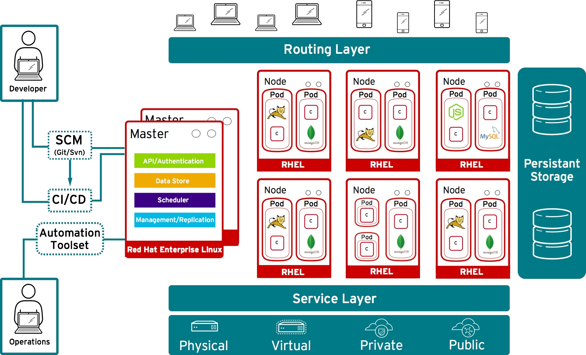

# Installation

The installation of OpenShift Container Platform (OCP); will be done via ansible. More information can be found using the OpenShift [documentation site](https://docs.openshift.com/container-platform/latest/welcome/index.html).

For this installation we have the following

* Wildcard DNS entry like `*.apps.example.com`
* Servers installed with RHEL 7.x (latest RHEL 7 version) with a "minimum" install profile.
* Forward/Reverse DNS is a MUST for master/nodes
* SELinux should be enforcing
* Firewall should be running.
* NetworkManager 1.0 or later
* Masters
  * 4CPU
  * 16GB RAM
  * Disk 0 (Root Drive) - 50GB
  * Disk 1 - 100GB Raw/Unformatted  (runs docker containers)
* Nodes
  * 4CPU
  * 16GB RAM
  * Disk 0 (Root Drive) - 50GB
  * Disk 1 - 100GB Raw/Unformatted  (runs docker containers)
  * Disk 2 - 500GB Raw/Unformatted (for Container Native Storage)

Here is a diagram of how OCP is layed out

